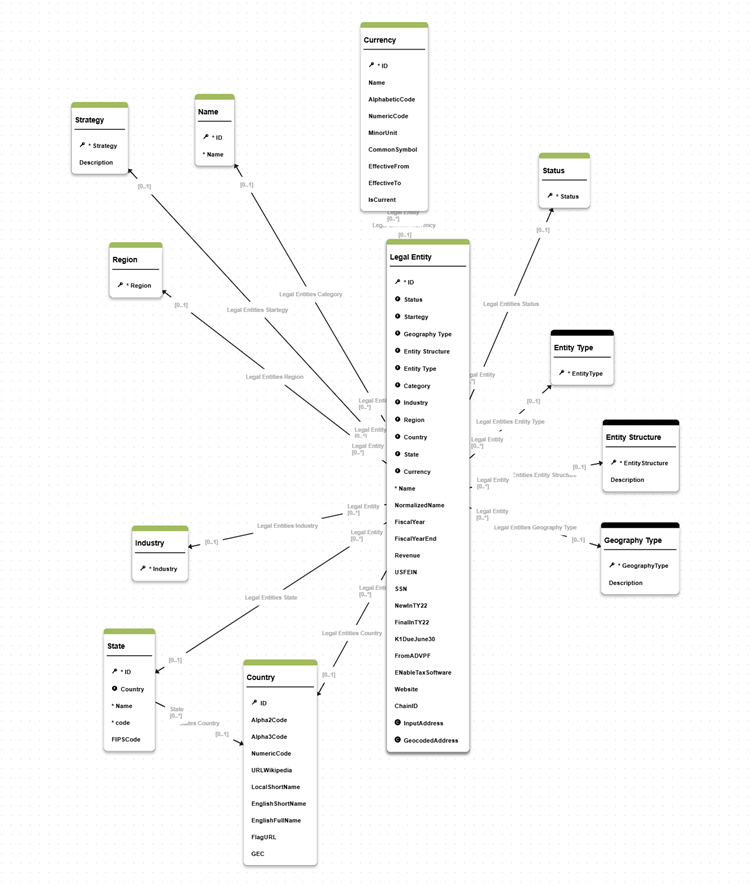
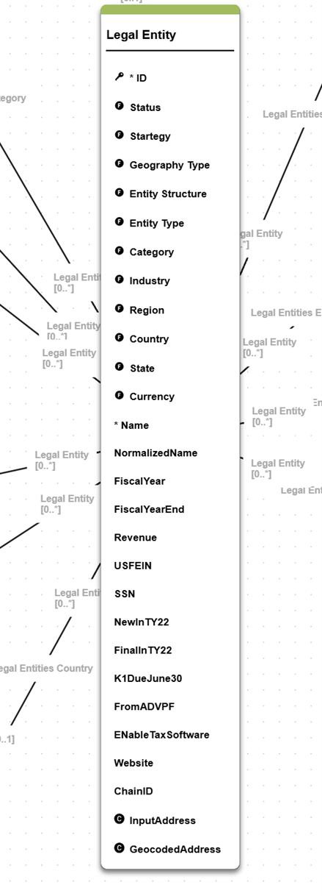
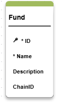
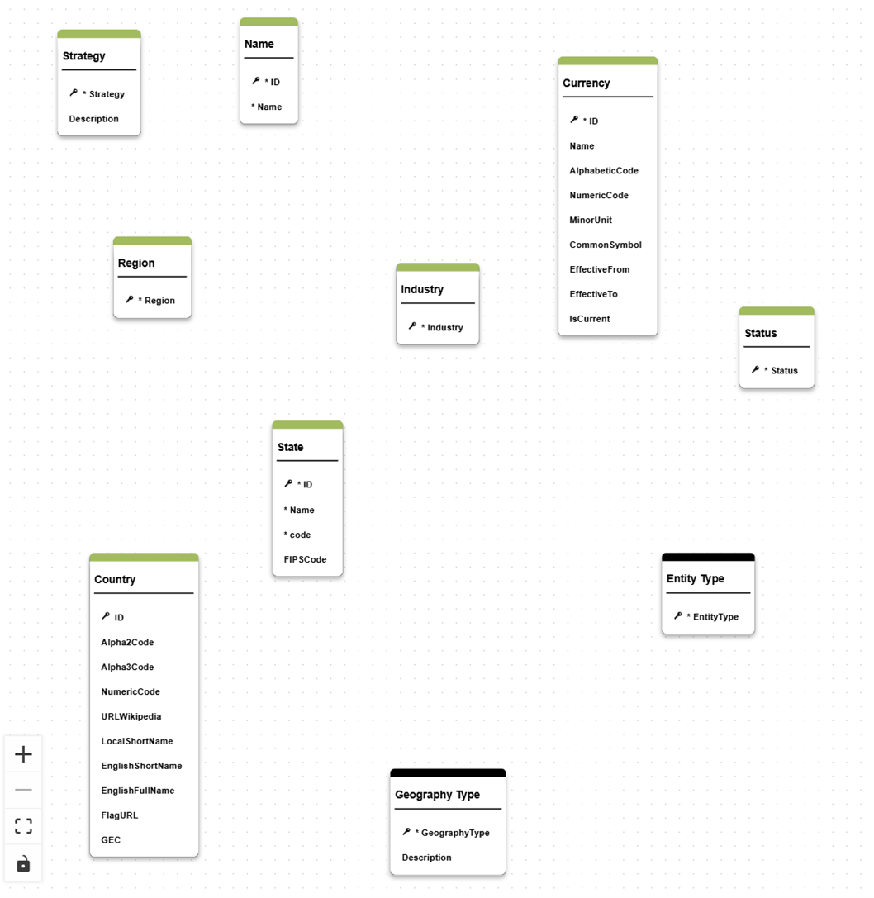

# Legal Entity

The Legal Entity model serves as the single source of truth for all Legal Entities, Offices, and Contacts within the organization. It is designed to unify and manage the complex relationships and hierarchies that exist between legal entities, their associated offices, and contact information.

In the private equity sector, Legal Entity data is often fragmented across multiple source systems, including CRM, Marketing, ERP, Finance, and Tax applications. Each system typically maintains its own version of Legal Entity records, resulting in data silos and duplication. On average, a single Legal Entity may appear as five separate master records—one in each system—all of which must be linked and reconciled to form a comprehensive, accurate view.

The primary objective of this model is to consolidate Legal Entity information from these disparate sources. By integrating data from all relevant systems, the model enables organizations to apply robust data quality rules, ensuring that the information is both accurate and complete. Advanced Match & Merge logic is then used to identify and unify duplicate records, creating a single, authoritative Golden Record for each Legal Entity within the xDM platform.

This consolidated approach not only streamlines data management and reporting but also supports regulatory compliance, operational efficiency, and strategic decision-making. The model’s flexible structure accommodates parent-child hierarchies, office locations, and contact relationships, providing a holistic view of the organization’s legal structure and its key stakeholders.

## Model structure

This model describe the legal entities and relationships available to describe the Legal Entity.




This model contains three main tables to describe the organization structure: Legal Entity, Fund and Site.

For detailed list of tables and attributes, please, refer to the  [model structure page](./model_structure.md).

### Legal Entity



This entity is the main entity for this model that contains main properties of a legal entity object, such as:
- name
- national identification number
- fiscal information
- revenu information
- website
- main address etc.

This is a Fuzzy matching entity that is using the following fields for matching:
- identification number
- normalized name
- normalized address.

>To change the matching strategy you need to edit the Employee.Entity.seml file, property 'matcher'.<br/>
>Please, use the Semarchy [SDP documentation](https://docs.semarchy.com/sdp/reference/vscode/objects/Entity#matcher) to guide you. 

The enrichement of Name and Address is managed through predefined enrichers. This model is designed in a way to allow storing the source data and comparing Source vs Enriched data as enriched elements are stored in separate properties.

All reference fields are designed as foreign keys rather than LOV to ensure that it is possible to put a governance process around reference data management as well.

Legal Entity has a recursive reference to manage parent-child relationships and legal entities hierarchy.

### Fund



The fund entity describes Fund elements, that is part of the Legal Entity definition. A Fund is considered to be a substructure of a Legal Entity in the organization. It is linked to the legal entity through a link table FundLE. 
It is a N-N relationship.

Fund is a basic entity without matching rules.

### Site

The Site entity is the third important entity to describe a legal entity.
It refers to physical adresses of the legal entity and hosts metadata about different types of sites. 

Site is a basic entity without matching rules that uses two complex types: InputAddress and GeocodedAddress. 

## Reference data



Other tables in the model can be considered reference data that allows describing different aspects of the legal entity data domain such as:
- geographical data
- currencies
- entity classification (main type, industrie, ownership etc.)
- banking data.


### Country

The Country entity contains Alpha2 and Alpha3 code to being able to use it to store ISO codes or other codifications if needed.

There are also other attributes to have Wikipedia URL for example or translation if you need to use the Local Name.

### Currency

The Currency entity contains Alpha code to being able to use it to store ISO codes or other codifications if needed. 

In this version of the model it is possible to have versions of the currency through effective dates.

There are also other attributes to have Wikipedia URL for example or translation if you need to use the Local Name.

## Model components
### Legal Entity Hierarchy

This model illustrates the capacity to create flexible hierarchies to present data.
There is a fixed hierarchy in the model that stores Legal Entities structure based on the recursive parent-child relationship.

### Publishers

There are three predefined generic publishers in the model. You can customize or add other ones to reflect the systems which provide data for MDM consolidation:
- CRM - your CRM system that provides structure of the legal entity
- Investran - fund investment management system
- TAX - tax reporting management system.

These publishers are used for ranking in survivorship rules.
```
consolidationStrategy: PREFERRED_PUBLISHER
        publisherRankings:
            - _type: ConsoPublisherRanking
              publisher: Organization.publishers.CRM
            - _type: ConsoPublisherRanking
              publisher: Organization.publishers.Investran
            - _type: ConsoPublisherRanking
              publisher: Organization.publishers.TAX
```
As part of your customizations you can change publishers labels and/or IDs, add or remove publishers and adjust ranking for survivorship functions. 

### Enrichers

This model includes several enrichers to manage transformatins for Legal Entity fields:
- autopopulate currency 
- normalize entity name
- populate entity type
- manage status.

These enrichers are all based on native Semarchy capabilities and are common cases of data cleansing applied to Legal Entity MDM data based on Semarchy customers feedback. 

All transformations are executed in PRE_CONSO to manage source data quality. To keep the source data available for review, the transformed and the source are stored in different attributes of the Employee table.

As part of your customizations you can modify or remove existing enrichers or you can create your own transformation rules based on these examples. 

Other entities also have enrichers. For more details, please, refer to the [enrichers page](./enrichers.md)

### Validations
Different types of validations are implemented on this model:
- Mandatory fields validation is defined for each entity. For full list of mandatory fields, please, refere to the [model structure page](./model_structure.md).
- Maximum length restriction is applied on the String fields.
- Legal Entity name cannot start with a special character (DetectSpecialCharacter.SemQLValidation.seml)
- USFEIN attribute format is validate through regular expression (USFEIN.SemQLValidation.seml)

You can extend validation on model fields to apply your sepcific business rules. 

For the full list of validations present in the model refer to the [validations page](./validations.md)

### Work for developpers

The current data model is developed to cover basic use cases for Legal entity structure data management. From technical perspective, this model illustrate different application components that you can use to extend and customize.
From functional perspective, this data model can be used as a first MVP for your Legal entity data management implementation and serve as basis for MDM design workshops.

It enables you to perform the following actions as support for your design workshops:
- load your data and apply some data quality rules to determine your current data state
- display UI/UX to business users and work on their feedback and improvements
- easily display matching rules and stewardship process to help define your specific consolidation approach.

To enhance and extend this data model main areas for your DM developers would be:
1. <b>User interface.</b> The current data model has basic UI developed with some simple views, display card and steppers. However, this can be enhanced and extended to better match your business users preferences
3. <b>Matching rules.</b> 
4. <b>Workflows.</b> The model includes a generic 4-eyes principle workflow for creation and update process. You can add steps and enhance the workflow based on your governance process.