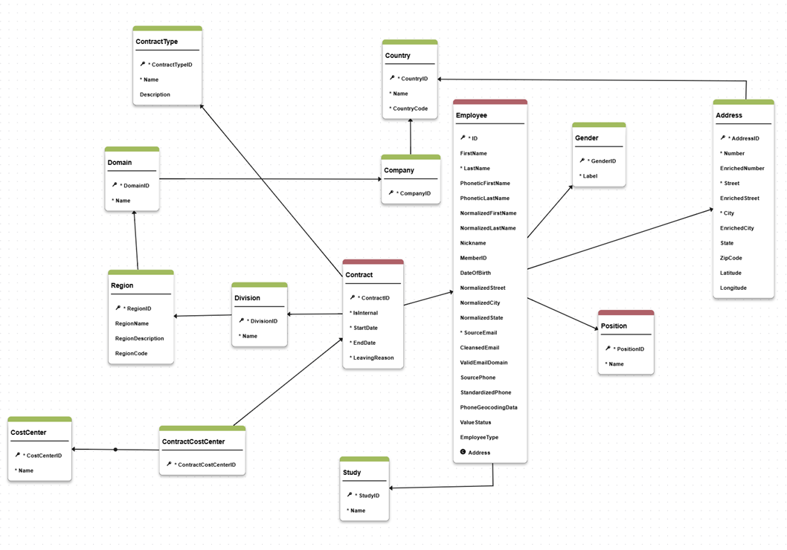

# HR Organization

This Master Data Management (MDM) model for HR Organization is designed to centralize and harmonize employee and contract information from multiple source systems. The model ensures that all departments and applications across the enterprise have access to consistent, accurate, and up-to-date data, reducing duplication and improving data quality.

- **Data Consolidation:** Integrates and reconciles data from disparate sources, ensuring a single version of truth for HR information.
- **Data Quality & Enrichment:** Applies business rules, validations, and enrichers to improve data quality and support matching strategies.
- **Reference Data Management:** Manages lists of values and hierarchies (e.g., Division, Region, Domain, Company) to support organizational structure.
- **Publisher Management:** Supports ranking and source system identification for employees and contracts.
- **Extensibility:** Provides a flexible foundation for UI components, workflows, and future enhancements, including CI/CD integration and reusable complex types.

This model is a robust foundation for enterprise HR data management, enabling better decision-making, compliance, and operational efficiency.

## Prerequisites

To correctly integrate this model to DM, you have to create a role in the platform named :
- DataSteward
This role is used by the workflow example present in the data model.

## Model structure

This model describe entities and relationships available to describe the Human Resource organization.



This model contains two main entities - Employee and Contract - as well as reference data entities that are used to provide hierarchial organization of Employees and typology to the Contracts.
You can extend the data model by adding your own entities and/or attributes to the existing ones.

For detailed list of tables and attributes, please, refer to the [model structure page](./model_structure.md).

### Employee

This entity is one of the two main entities for this model and describes main data around Employee object. 

It is a Fuzzy matching entity that includes attributes enriched during data creation process with phonetization to prepare exact matching strategy and improve matching performance. This method was choosen for simplicity and effeciency in termes of performance, however you can adjust this to match your business requirement (for example, using distance calculation etc.) 

Main fields contributing to the matching decision are:
- naming fields: Normalized Last Name, Normalized First name, nickname
- date of birth
- Member ID (internal or national)
- Normalized address fields
- Normalized phone and email fields

>To change the matching strategy you need to edit the Employee.Entity.seml file, property 'matcher'.<br/>
>Please, use the Semarchy [SDP documentation](https://docs.semarchy.com/sdp/reference/vscode/objects/Entity#matcher) to guide you. 

This model is designed in a way to allow storing the source data and comparing Source vs Enriched data as enriched elements are stored in separate properties.

All reference fields are designed as foreign keys rather than LOV to ensure that it is possible to put a governance process around reference data management as well.
The field Employee Type is designed as List of Value to illustrate LOV creation in Semarchy Design XP.

### Contract

This is also one of the main entities of this data model that provides description of the Contract object.
The contract must have an Employee and an Employee might have several different contracts.

The table is designed to allow manage main contract and additional contracts.  While this model doesn't explicitly include a contract version attribute, it enables version management through validity dates.

### Reference data

Other tables in the present model are considered reference data for the HR domain. The choice to design reference data as separate tables rather than as Semarchy List of Values is based on the best practice to have governance around reference data through workflows and flexible approach to creation and update. 

All tables are design as Basic entity without need for matching on the assumption that reference data comes cleansed in the MDM system. 

You can find the full list of tables with attributes on the [model structure page](./model_structure.md).

## Model components
### Employee Hierarchy

This model illustrates the capacity to create flexible hierarchies to present data.
There is a fixed hierarchy in the model that stores Employees organization based on Division/Region/Domain/Company.

### Publishers

As part of this model you have four different publishers for your source systems to integrate with SDP DM. 
To keep it generic, the publishers are identified as :
- MainHRMS - your main HR management system
- SecondaryHRMS - your secondary HR management system (for example, a regional specific one)
- PayrollSystem - system used to manage payroll
- IDP - Identity provider manager

These publishers are used for ranking in Employee survivosrship rules:

```
consolidationStrategy: PREFERRED_PUBLISHER
        publisherRankings:
            - _type: ConsoPublisherRanking
              publisher: Organization.publishers.MainHRMS
            - _type: ConsoPublisherRanking
              publisher: Organization.publishers.PayrollSystem
            - _type: ConsoPublisherRanking
              publisher: Organization.publishers.IDP
```
As part of your customizations you can change publishers labels and/or IDs, add or remove publishers and adjust ranking for survivorship functions. 


### Enrichers

This model includes several enrichers to manage transformatins for Employee fields:
- normalize first and last name
- phonetize first and last name
- lookup nickname
- normalize address
- cleanse email
- standardize phone number.

These enrichers are all based on native Semarchy capabilities and are common cases of data cleansing applied to HR MDM data based on Semarchy customers feedback. 

All transformations are executed in PRE_CONSO to manage source data quality. To keep the source data available for review, the transformed and the source are stored in different attributes of the Employee table.

As part of your customizations you can modify or remove existing enrichers or you can create your own transformation rules based on these examples. 

### Validation

Different types of validations are implemented on this model:
- Mandatory fields validation is defined for each entity. For full list of mandatory fields, please, refere to the [model structure page](./model_structure.md).
- Maximum length restriction is applied on the String fields.
- Email is validated to match accepted domains through plugin validation (InvalidEmail.PluginValidation.seml)

You can extend validation on model fields to apply your sepcific business rules. 

## Work for developers

The current data model is developed to cover basic use cases for HR data management. From technical perspective, this model illustrate different application components that you can use to extend and customize.
From functional perspective, this data model can be used as a first MVP for your HR data management implementation and serve as basis for MDM design workshops.

It enables you to perform the following actions as support for your design workshops:
- load your data and apply some data quality rules to determine your current data state
- display UI/UX to business users and work on their feedback and improvements
- easily display matching rules and stewardship process to help define your specific consolidation approach.

To enhance and extend this data model main areas for your DM developers would be:
1. <b>User interface.</b> The current data model has basic UI developed with some simple views, display card and steppers. However, this can be enhanced and extended to better match your business users preferences
2. <b>Hierarchy.</b> The hierarchy defined in the current data model includes 4 levels to represent a full hierarchy based on Semarchy's customers feedback. However, you can remove or add levels based on your requirements.
3. <b>Matching rules.</b> For Employee table the model applies several matching rules to detect duplicates. These are explained in the Employee table description and represent general matching rules for person data. You can extend and change these rules based on your business requirements.
4. <b>Workflows.</b> The model includes a generic 4-eyes principle workflow for creation and update process. You can add steps and enhance the workflow based on your governance process.


