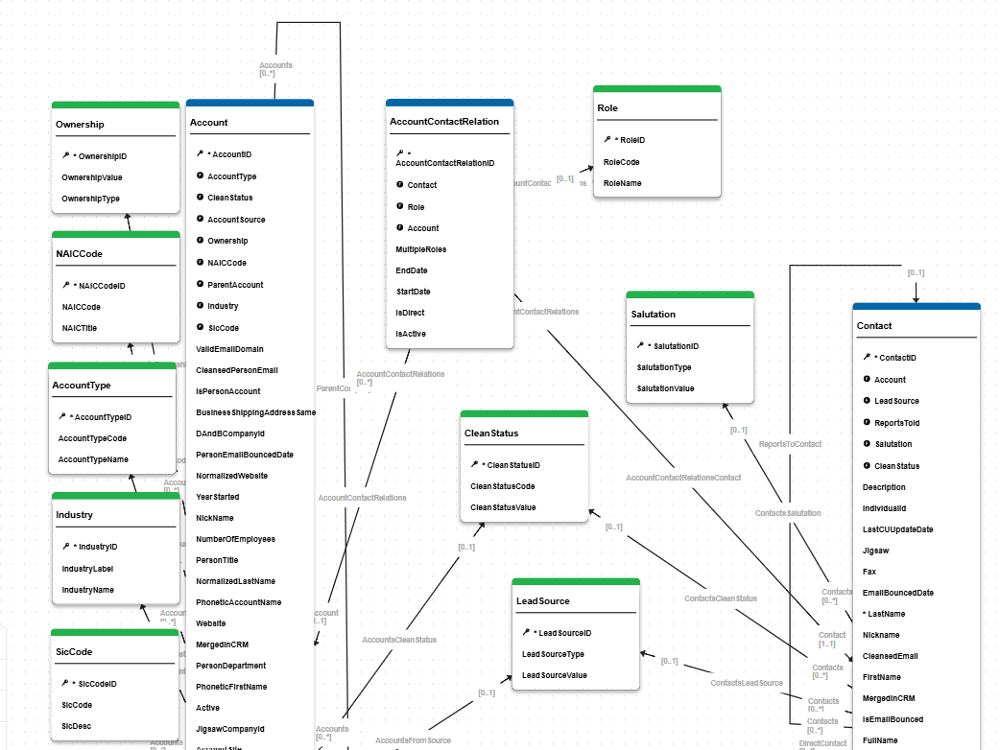
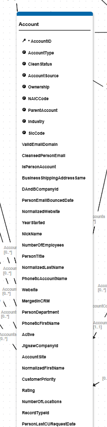
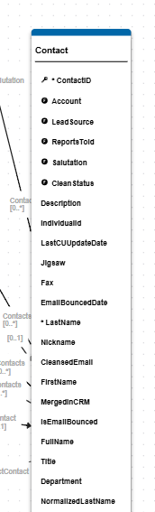
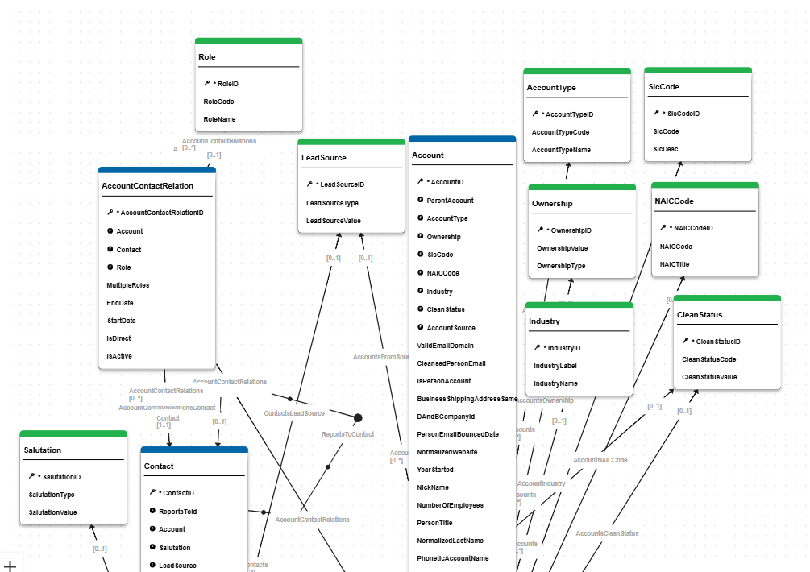
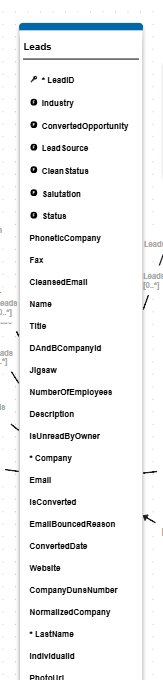
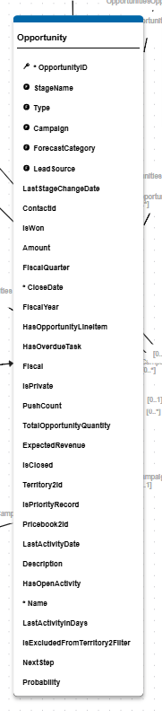
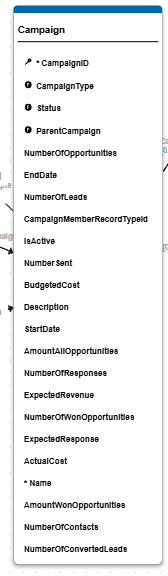
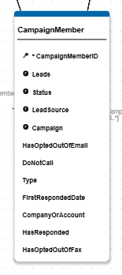

# Salesforce B2B

This Master Data Management (MDM) model for Salesforce B2B is designed to centralize and harmonize sales, marketing, and customer relationship data from multiple source systems. The model ensures that all departments and applications across the enterprise have access to consistent, accurate, and up-to-date information about accounts, contacts, leads, opportunities, and campaigns, reducing duplication and improving data quality.

The MDM model is inspired from the [Salesforce Sales Cloud](https://developer.salesforce.com/docs/platform/data-models/guide/sales-cloud-overview.html). The number of entities used could be less than the actual entities present in the Sales Cloud model to meet the B2B requirements and can be introduced based upon the business requirements.

- **Data Consolidation:** Integrates and reconciles data from disparate SFDC, ERP, marketing, and financial systems, ensuring a single version of truth for sales and customer information.
- **Data Quality & Enrichment:** Applies business rules, validations, and enrichers to improve data quality including name normalization, address geocoding, phone standardization, and email cleansing.
- **Reference Data Management:** Manages lists of values and reference tables (e.g., Account Type, Campaign Status, Lead Source, Industry) to support consistent data categorization and reporting.
- **Publisher Management:** Supports ranking and source system identification for multiple data sources including SFDC, Marketing, ERP, Financial, and Data Entry systems.
- **Extensibility:** Provides a flexible foundation for UI components, workflows, and future enhancements, including CI/CD integration and reusable complex types for addresses and phone numbers.

This model is a robust foundation for enterprise sales and customer data management, enabling better decision-making, sales forecasting, campaign effectiveness tracking, and operational efficiency.

## Prerequisites

To correctly integrate this model to DM, you have to create the following components in the platform:
- Publishers configured for your source systems (SFDC, ERP, MKT, FIN, DataEntry)
- Google Maps API plugin configured for address geocoding (if using address enrichment features)
- Email convergence plugin for email cleansing
- Phone convergence plugin for phone standardization
- Person name convergence plugin for name normalization
- Text convergence plugin for phonetic matching

## Model Structure

This model describes entities and relationships available to manage sales, marketing, and customer data in a B2B context.

This model contains several core entities - Account, Contact, Leads, Opportunity, and Campaign - as well as reference data entities that provide typology and hierarchical relationships. The model supports both business accounts and person accounts, enabling comprehensive B2B and B2C scenarios.

You can extend the data model by adding your own entities and/or attributes to the existing ones.

For detailed list of tables and attributes, please, refer to the [model structure page](./model_structure.md).

### Account

This entity is one of the core entities for this model and describes accounts, which represent organizations such as customers, competitors, and partners. The Account entity also supports person accounts for B2C scenarios.

It is a Fuzzy matching entity that includes attributes enriched during data creation process with phonetization and geocoding to prepare exact matching strategy and improve matching performance. This method was chosen for simplicity and efficiency in terms of performance, however you can adjust this to match your business requirements.

Main fields contributing to the matching decision are:
- Naming fields: Normalized Account Name, Phonetic Account Name
- Person account fields: Normalized First/Last Name, Phonetic First/Last Name, Nickname
- Website: Normalized Website
- Address fields: Geocoded Billing and Shipping addresses
- Identifiers: D&B Company ID, DUNS Number, Jigsaw Company ID

**Matching Rules:**
1. **Exact Name Enriched Address** (Score: 98) - Matches business accounts on normalized account name and geocoded billing address components
2. **Phonetic Name Match** (Score: 90) - Matches on phonetic account name and postal code
3. **Website And Parent Match** (Score: 60) - Matches on normalized website and parent account name

>To change the matching strategy you need to edit the [Account.Entity.seml](../src/sales360/entities/Account/Account.Entity.seml) file, property 'matcher'. 
>Please, use the Semarchy [SDP documentation](https://docs.semarchy.com/sdp/reference/vscode/objects/Entity#matcher) to guide you.

This model is designed in a way to allow storing the source data and comparing Source vs Enriched data as enriched elements are stored in separate properties (e.g., Website vs NormalizedWebsite, AccountName vs NormalizedAccountName).

All reference fields are designed as foreign keys rather than LOV to ensure that it is possible to put a governance process around reference data management. Some fields like Active, Rating, and UpsellOpportunity are designed as Lists of Values to illustrate LOV creation in Semarchy Design XP.

### Contact

This entity represents contacts, which are people associated with accounts. Contacts are key stakeholders in customer relationships and sales processes.

The Contact entity is also a Fuzzy matched entity with enrichment capabilities. Main fields contributing to the matching decision are:
- Naming fields: Normalized First Name, Normalized Last Name, Nickname
- Date of Birth
- Email: Cleansed Email
- Phone numbers: Standardized Phone and Mobile Phone
- Address fields: Geocoded Mailing and Other addresses

**Matching Rules:**
1. **Normalized Name Nick Name DOB Email** (Score: 98) - Matches on normalized names or nicknames, date of birth, and cleansed email
2. **Normalized Name Address DOB Phone** (Score: 96) - Matches on normalized names or nicknames, date of birth, and standardized phone numbers
3. **Exact Email** (Score: 68) - Matches on exact cleansed email address

Contacts can be associated with multiple accounts through the AccountContactRelation entity, allowing for complex relationship modeling.

### AccountContactRelation

This entity captures the many-to-many relationship between accounts and contacts. It is used to track which contacts are related to which accounts, when those relationships are active, and what role the contact plays within the account.

Key attributes include:
- Start and end dates for the relationship
- IsActive flag to indicate if the relationship is current
- IsDirect flag to identify the contact's primary account
- Role and MultipleRoles to capture contact responsibilities across accounts

**Matching Rule:**
1. **Same Direct Parent Or Relation** (Score: 100) - Matches relations with the same account and contact

**Enrichment:**
- **Multiple Relations** - Splits multiple roles provided in a single value and normalizes the role data
- **Account ID** - Copies the contact's account reference into the relation when not explicitly provided
- **Is Direct** - Sets `IsDirect` when the relation points to the contact's primary account

**Validation:**
- End date must be greater than or equal to start date

### Leads

This entity represents prospects or potential customers that have not yet been qualified as opportunities. Leads contain both personal information and company details.

The Leads entity is a Fuzzy matched entity designed to identify duplicate leads before they are converted to accounts and contacts. Main fields contributing to the matching decision are:
- Naming fields: Normalized First Name, Normalized Last Name
- Company fields: Normalized Company, Phonetic Company
- Address: Geocoded Address
- Phone: Standardized Phone
- Email: Cleansed Email

**Matching Rules:**
1. **Exact Name Company** (Score: 100) - Matches on normalized individual names and company name (both normalized and phonetic)
2. **Exact Phone Address Company** (Score: 96) - Matches on normalized company name, geocoded address components, standardized phone, and cleansed email

Leads can be converted to Accounts, Contacts, and Opportunities. The model tracks conversion status and related converted records.

### Opportunity

This entity represents sales opportunities or pending deals. Opportunities are linked to accounts and track the sales pipeline.

The Opportunity entity is a Fuzzy matched entity. Key attributes include:
- Opportunity name and description
- Amount and expected revenue
- Stage name and forecast category
- Close date and probability
- Campaign source
- Opportunity type

Opportunities can have multiple contacts associated through the OpportunityContactRole entity, defining each contact's role in the opportunity.

### OpportunityContactRole

This entity captures the relationship between opportunities and contacts, including the role the contact plays in the sales process. It supports multiple contacts per opportunity and highlights the primary decision maker or stakeholder.

Key attributes include:
- IsPrimary flag to indicate the primary contact on the opportunity
- Role and MultipleRoles to capture contact responsibilities

**Matching Rule:**
1. **Same Parent** (Score: 100) - Matches roles with the same opportunity and contact

**Enrichment:**
- **Multiple Roles** - Separates single and multiple roles when roles are provided in a delimited value

### Campaign

This entity represents marketing campaigns such as direct mail promotions, webinars, trade shows, or digital marketing initiatives.

The Campaign entity is a Fuzzy matched entity. Key attributes include:
- Campaign name and description
- Campaign type and status
- Start and end dates
- Budget and actual costs
- Expected revenue and response rate
- Parent campaign for campaign hierarchies

Campaigns are connected to Leads and Contacts through the CampaignMember entity, tracking engagement and response.

### CampaignMember

This entity represents the association between a campaign and either a lead or a contact, tracking participation and response to marketing campaigns.

Key attributes include:
- Status (e.g., Sent, Responded, Opened)
- HasResponded flag (automatically set based on status)
- Type (automatically determined as 'Lead' or 'Contact')
- Lead source
- First responded date

### Reference Data

Other tables in the present model are considered reference data for the sales domain. The choice to design reference data as separate tables rather than as Semarchy List of Values is based on the best practice to have governance around reference data through workflows and flexible approach to creation and update.

Reference entities include:
- **Account Type** - Types of accounts (e.g., Customer, Competitor, Partner)
- **Campaign Type** - Types of campaigns (e.g., Direct Mail, Referral Program)
- **Campaign Status** - Campaign statuses (e.g., Planned, In Progress)
- **CampaignMemberStatus** - Statuses for campaign members
- **Clean Status** - Data.com clean status indicators
- **Forecast Category** - Forecast categories based on opportunity stage
- **Industry** - Industry classifications
- **Lead Source** - Sources of leads and opportunities
- **Lead Status** - Status codes for leads
- **NAIC Code** - North American Industry Classification System codes
- **Nickname** - Nickname lookup table
- **Opportunity Type** - Types of opportunities (e.g., Existing Business, New Business)
- **Ownership** - Ownership types (e.g., Private, Public, Subsidiary)
- **Role** - Roles for contacts in accounts and opportunities
- **Salutation** - Honorifics for names
- **SIC Code** - Standard Industrial Classification codes
- **Stage Name** - Opportunity stage names

All reference tables are designed as Basic entities without matching on the assumption that reference data comes cleansed into the MDM system.

You can find the full list of tables with attributes on the [model structure page](./model_structure.md).

## Model Components

### Account Hierarchies

This model illustrates the capacity to create flexible hierarchies to present data. The Account entity includes a self-reference to ParentAccount, allowing for the creation of account hierarchies to represent corporate structures and relationships.

### Complex Types

The model includes two reusable complex types:
- **StandardizedAddressType** - Provides both input fields (street, city, state, zip, country) and geocoded output fields (GeoStreetNumber, GeoStreetName, GeoLocality, GeoState, GeoPostalCode, GeoCountry, GeoLatitude, GeoLongitude, GeoQuality, GeoStatus)
- **StandardizedPhoneType** - Includes input phone field, standardized phone number output, and phone geocoding data

These complex types ensure consistent address and phone number handling across all entities in the model.

### Publishers

As part of this model you have five different publishers for your source systems to integrate with SDP DM.
The publishers are identified as:
- **SFDC** - Salesforce application (primary source for salesforce data)
- **MKT** -  Marketing automation platform (primary source for campaign data)
- **ERP** -  Enterprise Resource Planning system (source for billing and financial data)
- **FIN** -  Financial system (source for revenue and financial metrics)
- **DataEntry** - Manual data entry interface (lowest priority for survivorship)

These publishers are used for ranking in survivorship rules. As part of your customizations you can change publishers labels and/or IDs, add or remove publishers and adjust ranking for survivorship functions based on your data quality and business requirements.

### Enrichers

This model includes numerous enrichers to manage transformations for various entity fields. For detailed information about all enrichers, please refer to the [enrichers documentation](./enrichers.md).

**Account enrichers include:**
- **Normalize Account Name** - Trims and converts account name to uppercase
- **Phonetic Account Name** - Creates phonetic representation using Metaphone algorithm
- **Normalize Website** - Removes protocols and www prefix from websites
- **Business Type Normalizer** - Removes common business suffixes (Corp, Inc, Ltd, etc.)
- **Geocoded Billing Address** - Geocodes billing address using Google Maps API
- **Geocoded Shipping Address** - Geocodes shipping address using Google Maps API
- **Business Shipping Address Same** - Determines if billing and shipping addresses match
- **Standardize Phone** - Standardizes account phone numbers

**Contact enrichers include:**
- **Normalize Name** - Normalizes first and last names
- **Nickname** - Looks up nicknames based on first name
- **Cleansed Email** - Cleanses and validates email addresses
- **Geocoded Mailing Address** - Geocodes contact mailing address
- **Geocoded Other Address** - Geocodes contact alternative address
- **Standardize Phone** - Standardizes contact phone numbers
- **Standardize Mobile Phone** - Standardizes mobile phone numbers

**Lead enrichers include:**
- **Normalized Name** - Normalizes lead first and last names
- **Normalized Company** - Normalizes lead company name
- **Phonetic Company Name** - Creates phonetic representation of company name
- **Enriched Email** - Cleanses lead email addresses
- **Geo Coded Address** - Geocodes lead addresses
- **Standardized Phone** - Standardizes lead phone numbers

**Other entity enrichers:**
- **CampaignMember** - HasResponded flag setter, Type determination (Lead/Contact)
- **OpportunityContactRole** - Multiple roles handler
- **AccountContactRelation** - Multiple relations handler, IsDirect flag setter, AccountID setter
- **CleanStatus, Industry** - Text normalization enrichers

All transformations are executed in PRE_CONSO to manage source data quality. To keep the source data available for review, the transformed and the source are stored in different attributes where applicable.

As part of your customizations you can modify or remove existing enrichers or you can create your own transformation rules based on these examples.

### Validations

Different types of validations are implemented on this model. For detailed information about all validations, please refer to the [validations documentation](./validations.md).

**Implemented validations include:**
- **Mandatory fields validation** - Defined for core entities. For full list of mandatory fields, please refer to the [model structure page](./model_structure.md). Examples include:
  - Account: AccountName
  - Contact: LastName
  - Leads: Company, LastName
  - Opportunity: OpportunityName
  - Campaign: CampaignName
- **Maximum length restriction** - Applied on String fields across all entities
- **Date range validation** - End dates must be greater than or equal to start dates (Campaign, AccountContactRelation)
- **Year validation** - YearStarted in Account cannot be 5 digits
- **Email validation** - Email addresses are validated through the Email Convergence Plugin

You can extend validation on model fields to apply your specific business rules.

## Work for Developers

The current data model is developed to cover basic use cases for B2B sales and marketing data management. From a technical perspective, this model illustrates different application components that you can use to extend and customize. From a functional perspective, this data model can be used as a first MVP for your sales data management implementation and serve as basis for MDM design workshops.

It enables you to perform the following actions as support for your design workshops:
- Load your Salesforce or other SFDC data and apply data quality rules to determine your current data state
- Display UI/UX to business users through the Salesforce B2B Hub application and work on their feedback and improvements
- Easily display matching rules and stewardship process to help define your specific consolidation approach
- Demonstrate campaign effectiveness and lead-to-opportunity conversion tracking

To enhance and extend this data model, main areas for your DM developers would be:

1. **User Interface.** The current data model has a Salesforce B2B Hub application with global search capabilities for Accounts, Contacts, Leads, Opportunities, and Campaigns. Model diagrams are included for Core Entities, Campaign/Opportunity/Lead relationships, and Account/Contact relationships. However, this can be enhanced and extended with custom views, dashboards, and steppers to better match your business users' preferences.

2. **Hierarchies.** The model includes account hierarchies through the ParentAccount reference and campaign hierarchies through the ParentCampaign reference. You can extend these or add additional hierarchies based on your organizational requirements (e.g., territory hierarchies, product hierarchies).

3. **Matching Rules.** For Account, Contact, and Leads entities, the model applies several matching rules to detect duplicates. These are explained in each entity description and represent general matching rules for B2B data. The Account entity uses a combination of name, address, and website matching. Contact uses name, DOB, email, and phone. Leads uses name, company, address, email, and phone. You can extend and change these rules based on your business requirements and data quality objectives.

4. **Workflows.** The model includes basic steppers for data entry and management. You can add workflow steps and enhance the processes based on your governance requirements, such as adding approval workflows for high-value opportunities, data stewardship workflows for account merges, or campaign approval processes.

5. **Lead Conversion.** The Leads entity tracks conversion to Account, Contact, and Opportunity. You can implement automated or semi-automated lead conversion workflows based on lead scoring, qualification criteria, or manual approval processes.

6. **Integration with External Systems.** The publisher model supports multiple source systems. You can configure and extend integration patterns for your specific SFDC, ERP, marketing automation, and other systems. Consider implementing bi-directional synchronization for critical entities.

7. **Advanced Analytics.** Leverage the consolidated data for advanced analytics such as:
   - Customer 360-degree view combining account, contact, opportunity, and campaign data
   - Sales pipeline analysis and forecasting
   - Campaign ROI and effectiveness measurement
   - Lead source attribution and conversion funnel analysis
   - Territory and quota management

8. **Complex Types Extension.** The StandardizedAddressType and StandardizedPhoneType can serve as templates for additional complex types such as StandardizedEmailType, SocialMediaProfileType, or CustomAttributeGroupType based on your specific needs.
