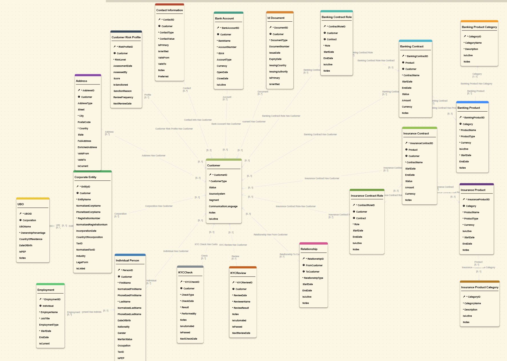

# Finance KYC

The Finance KYC model serves as the single source of truth for all Customers, Individuals, Corporate Entities, Accounts, and related KYC data within the organization. It is designed to unify and manage the complex relationships and hierarchies that exist between customers, their associated persons, accounts, contracts, and compliance information.

In the financial sector, customer and KYC data is often fragmented across multiple source systems, including CRM, Banking, Insurance, Risk, and Compliance applications. Each system typically maintains its own version of customer records, resulting in data silos and duplication. On average, a single customer may appear as several separate master records—one in each system—all of which must be linked and reconciled to form a comprehensive, accurate view.

The primary objective of this model is to consolidate customer and KYC information from these disparate sources. By integrating data from all relevant systems, the model enables organizations to apply robust data quality rules, ensuring that the information is both accurate and complete. Advanced Match & Merge logic is then used to identify and unify duplicate records, creating a single, authoritative Golden Record for each customer within the Semarchy Data Platform.

This consolidated approach streamlines data management and reporting, supports regulatory compliance (such as AML/KYC), operational efficiency, and strategic decision-making. The model’s flexible structure accommodates customer hierarchies, beneficial ownership, account relationships, and contract links, providing a holistic view of the organization’s customer base and risk exposure.

## Model structure

This model contains several key tables to describe the Finance KYC domain: customer, IndividualPerson, CorporateEntity, UBO, Accounts, riskProfile, contracts, and relationships.

For a detailed list of tables and attributes, please refer to the [model structure page](./model_structure.md).

## Documentation Map

- `model_structure.md` — conceptual overview of the core entities and how they relate.
- `enrichers.md` — description of enrichers.
- `validations.md` — description of validations.

For implementation specifics, browse the `src/FinanceKYC` folder that accompanies this documentation.

## Use cases and targeted personas

This accelerator is built to support a variety of scenarios and personas around Customer domain use cases in the Finance industry.

From a single, unified data model, we’ve structured this accelerator into three data applications. Each of these applications is tailored to a specific persona and their business needs:

1- The first application **Finance KYC Customer 360** is geared toward Business Users who need a 360° customer view - covering portfolios, risk profiles, legal structures — and the ability to review and trigger KYC checks.

2- The second application **Finance KYC Products** is for Business Owners, who manage the Banking and Insurance product catalog.

3- Finally the third application **Finance Customer Database** is built for Data Stewards, the people responsible for overall data quality. This aplication lets Data Stewards review and take action on errors and deduplication suggestions.

## Getting Started

1. Import the model to your Semarchy design environment.
2. Paster your Google Map API Key in the src/FinanceKYC/entities/Address/enrichers/EnrichGoogleMaps.JavaPluginEnricher.seml to use Google Maps API. Otherwise - remove this enricher
3. Deploy the Finance KYC application to the desired data location to generate the physical schema
4. load the image library onto your tenant.
5. load the demo data via the Import section in the business UI (Admin & Documentation) or via API.
6. Assign DataSteward & BusinessUser privileges using the provided model privilege grants.
7. Launch one of the 3 applications.

## Roles

* semarchyAdmin: all access
* DataSteward: all access + workflow step processor (KYC Check in Finance KYC Customer 360)
* BusinessUser: all access + workflow initiator (Initiate KYC in Finance KYC Customer 360)

### How to create a user with the proper role that use your email address

1. create a new user on the platform based on your current email account (<first name>.<last name>@<yourDomain>.com) with the role added into the email address like this

        <first name>.<last name>+<role name>@<yourDomain>.com

2. Confirm your account via the email sent by the platform
3. Create a password + authenticator step in a private window
4. On the app where you’re connected as administrator, you can go to DM Admin, and add the proper role <role name> to this new user.
5. On your private window, the data applications are now accessible

## Main Capabilities and Key entities

### Customer

This entity is the main entity for this model that contains the main properties of a customer object, such as:
- name
- type (individual/corporate)
- status
- segment
- source system
- communication language

### IndividualPerson & CorporateEntity

These entities store detailed information about individuals and corporate entities, including personal details, registration numbers, and tax IDs. They are linked to customers and can be used for beneficial ownership (UBO) and compliance checks.

These two are Fuzzy matching entities. 

IndividualPerson uses the following fields for matching:
- Name
- DOB
- Nationality
- Gender
- Tax ID

CorporateEntity uses the following fields for matching:
- Corporation name
- Registration number
- Tax ID
- Country

>To change the matching strategy, edit the associated *.Entity.seml file, property 'matcher'.  
>Please use the Semarchy [SDP documentation](https://docs.semarchy.com/sdp/reference/vscode/objects/Entity#matcher) for guidance.

### Address

This entity stores location details. It is a fuzzy entity, meaning duplicate records are detected and merged into golden records during the certification process.

### KYCCheck & KYCReview

These entities store KYC check and review records, including check type, date, result, and reviewer information. They support compliance and audit requirements.

### UBO

The UBO entity links individuals and corporate entities to customers, supporting beneficial ownership tracking and regulatory compliance.

### Relationship

The Relationship entity captures links between customers, such as Family, custodian or shareholder relationships.

## Reference data

Other tables in the model can be considered reference data that allows describing different aspects of the Finance KYC data domain, such as:
- banking and insurance product categories

## Model components

### Customer Structure & Beneficial Ownership

This model illustrates the capacity to create flexible customer structures and ownership schemes. For instance UBO and Relationship entities allow modeling complex ownership and relationship networks.

### Publishers

There are predefined generic publishers in the model. You can customize or add other ones to reflect the systems which provide data for MDM consolidation:
- CRM – customer relationship management system
- ERP – banking system
- WEB – customer portal

These publishers are used for ranking in survivorship rules.

### Enrichers

This model includes several enrichers to manage transformations for customer and related fields:
- autopopulate normalized names
- standardize tax IDs
- automatically assigns check reviewers

All transformations are applied pre-consolidation to enhance source data quality. To keep the source data available for review, the transformed and the source are stored in different attributes.

Other entities also have enrichers. For more details, please refer to the [enrichers page](./enrichers.md).

### Validations

Different types of validations are implemented in this model:
- Mandatory fields validation is defined for each entity. For a full list of mandatory fields, please refer to the [model structure page](./model_structure.md).
- Maximum length restriction is applied on string fields.
- Dates of birth are checked for validity

You can extend validation on model fields to apply your specific business rules.

For the full list of validations present in the model, refer to the [validations page](./validations.md).

### Work for developers

The current data model is developed to cover basic use cases for Finance KYC data management. From a technical perspective, this model illustrates different application components that you can use to extend and customize. From a functional perspective, this data model can be used as a first MVP for your Finance KYC implementation and serve as a basis for MDM design workshops.

It enables you to perform the following actions as support for your design workshops:
- load your data and apply data quality rules to determine your current data state
- display UI/UX to business users and work on their feedback and improvements
- easily display matching rules and stewardship process to help define your specific consolidation approach

To enhance and extend this data model, main areas for your DM developers would be:
1. **User interface.** The current data model has basic UI developed with simple views, display cards, and steppers. This can be enhanced and extended to better match your business users' preferences.
2. **Matching rules.**
3. **Workflows.** The model includes generic workflows for creation and update processes. You can add steps and enhance the workflow based on your governance process.

---
