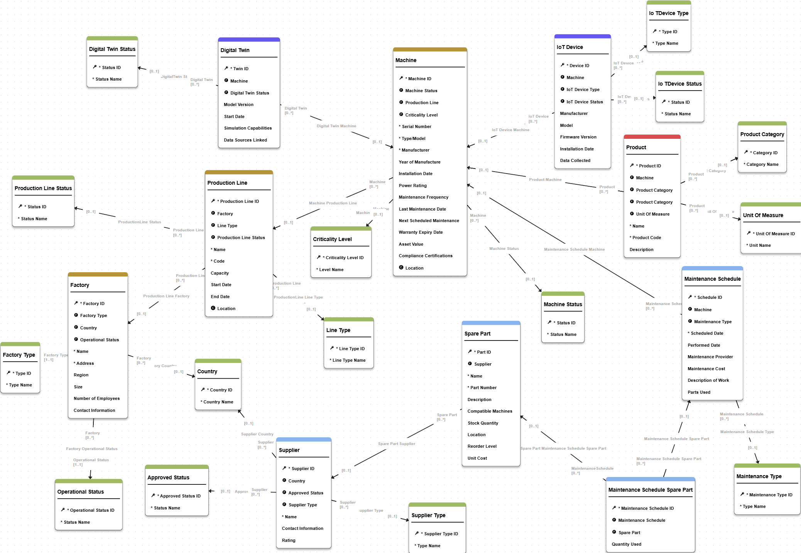

# Manufacturing Assets Accelerator

This accelerator delivers a ready-to-use data hub for managing factories, production lines, machines, and the digital assets that surround them. It ships with a curated logical model, publish-ready steppers, workflow orchestration, validations, and documentation so manufacturing teams can bootstrap asset management initiatives without starting from scratch. The experience targets data stewards responsible for maintaining the installed base—covering equipment genealogy, maintenance history, IoT telemetry, and supplier-dependent spare parts—all within the Semarchy xDM platform.

## Main Entities Overview

| Entity | Description |
| --- | --- |
| Factory | Represents a manufacturing site, including address, region, size, and contact information. |
| ProductionLine | Describes a production line or cell within a factory, capturing capacity, type, and operational status. |
| Machine | Master record for equipment installed on production lines, tracking lifecycle, maintenance dates, status, and criticality. |
| DigitalTwin | Virtual model associated with a machine, storing model version, start date, and simulation characteristics. |
| IoTDevice | Connected device linked to a machine, detailing manufacturer, model, firmware, collected data, and installation date. |
| MaintenanceSchedule | Planned or executed maintenance event, logging dates, provider details, cost, and work description. |
| MaintenanceScheduleSparePart | Junction entity documenting spare parts consumed during maintenance, including quantities. |
| SparePart | Catalog of replaceable parts and consumables, linked to suppliers and categorized by unit of measure. |
| Product | Finished goods manufactured on machines, with SKU, category, and measurement metadata. |
| Supplier | External or internal organization providing spare parts, classified by type, approval status, and geography. |
| Reference Entities | Lookup tables (statuses, types, categories, countries, units) that standardize classifications across the model. |

## Model structure

This model describe the Manufacturing assets model entities and relationships available.

For detailed list of tables and attributes, please, refer to the  [model structure page](./model_structure.md).

## Capabilities

- Manage the factory hierarchy from site to production line to machine, including specialty equipment such as IoT devices and digital twins.
- Capture maintenance schedules and the spare parts they consume, with validation rules that enforce data quality at authoring time.
- Expose authoring experiences, search, and workflow orchestration through a packaged application for stewards and operations teams.
- Support governed reference data (statuses, types, suppliers, product catalogs) to standardize asset classification.

## Documentation Map

- `model-structure.md` — conceptual overview of the core entities and how they relate.
- `business-processes.md` — description of steppers, workflows, validations, and enrichers.

For implementation specifics, browse the `src/Assets` folder that accompanies this documentation.

## Getting Started

1. Import the model to your Semarchy design environment.
2. Deploy the Manufacturing Assets application to the desired data location to generate the physical schema and load the demo data via the Import section in the business UI (Admin & Documentation) or via API.
3. Assign DataSteward & BusinessUser privileges using the provided model privilege grants.
4. Launch the application and use the authoring steppers documented in `business-processes.md`.

### Work for developpers

The current data model is developed to cover basic use cases for Manufacturing assets data management. From technical perspective, this model illustrate different application components that you can use to extend and customize.
From functional perspective, this data model can be used as a first MVP for your own implementation and serve as basis for MDM design workshops.

It enables you to perform the following actions as support for your design workshops:
- load your data and apply some data quality rules to determine your current data state
- display UI/UX to business users and work on their feedback and improvements
- easily display matching rules and stewardship process to help define your specific consolidation approach.

To enhance and extend this data model main areas for your DM developers would be:
0. <b>Entities.</b> To extend the content of the model
1. <b>User interface.</b> The current data model has basic UI developed with some simple views, display card and steppers. However, this can be enhanced and extended to better match your business users preferences
2. <b>Enrichers & Validation rules.</b> To extend the business compliance to your own rules & use cases
3. <b>Workflows.</b> The model includes a generic 4-eyes principle workflow for creation and update process. You can add steps and enhance the workflow based on your governance process.