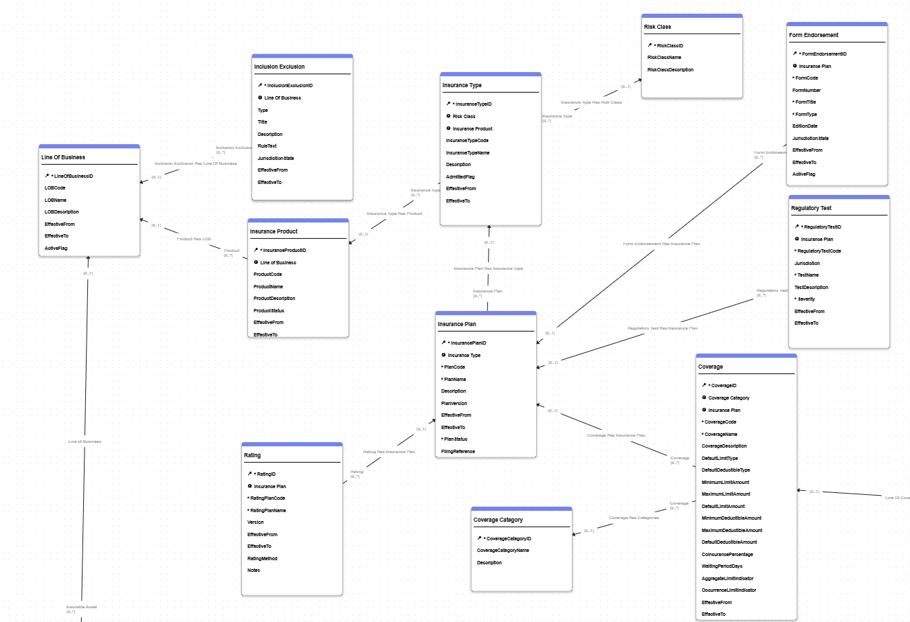
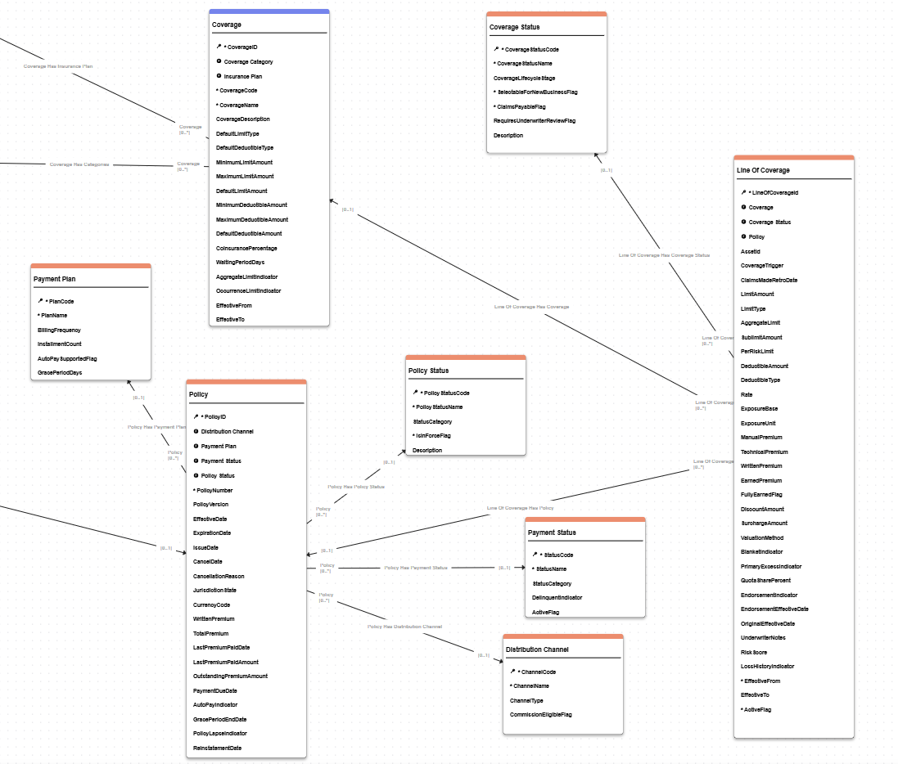
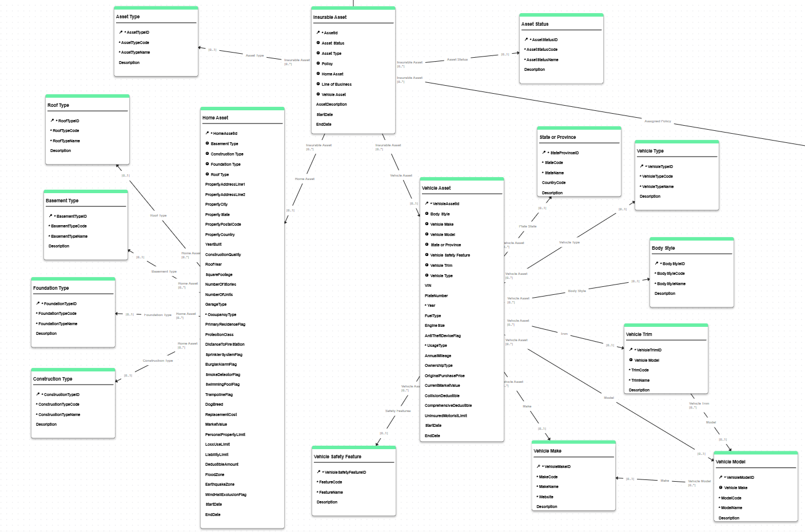

# Property and Casualty Insurance

The Property and Casualty (P&C) Insurance model delivers strong Master Data Management (MDM) value by creating a governed, enterprise-wide foundation for insurance product, policy, coverage, and insured asset data. From an MDM standpoint, its biggest strength is that it separates and then reconnects three critical domains: product configuration, policy operations, and insurable assets. This gives insurers a single trusted view while preserving business context.

The model is built as a practical accelerator for P&C data domains and can be extended based on your carrier's business requirements.

- **Data Consolidation:** Consolidates policy, line-of-coverage, and insured-asset data into a trusted master view.
- **Data Quality Controls:** Applies mandatory checks and SemQL validations to key entities before consolidation.
- **Reference Data Management:** Uses governed reference entities (for example, coverage status, distribution channel, body style, roof type) to standardize classifications.
- **Product Governance:** Structures product configuration across Line of Business, Insurance Product, Insurance Type, Insurance Plan, Coverage, Rating, Regulatory Test, and Form Endorsement.
- **Asset Mastering:** Supports fuzzy matching and stewardship for insured vehicle and property records.
- **Extensibility:** Includes UI components, action sets, steppers, model jobs, and reference relationships that can be adapted for production use.

This model serves as a robust starter for P&C insurers seeking a single source of truth across product and policy data.

## Prerequisites

To correctly deploy and use this model in SDP DM, configure the following components:

- Bring a Self-Hosted or SaaS Semarchy Data Platform
- Clone the repository in VS Code. Refer to the VERSION_INFO.md to use the right Semarchy Design XP extension version
- Open folder \sdp-ps-accelerators\vertical-models\Property&CasualtyInsurance in VS Code
- Build and Deploy the model
- Import image libraries by installing the Platform CLI and then executing
```
./sem dm admin image-library import pnc-ins -i ./pnc-ins.zip
```

- Publisher configured for policy administration source data:
	- `POL_ADMIN` (Policy Administration System)
- Integration job available in the model:
	- `INTEGRATE_ALL`
- API access for load automation (if using API-based initial loads)
- Optional: dashboard application `PropertyAndCasualty` if you plan to use the `Executive Dashboard` action from the app

Sample data load assets are included under:

- `../resources/demo-data/UI Import/` (UI import CSVs)
- `../resources/demo-data/API Import-curl/PnCInsurance.json` (API load payload)
- `../resources/demo-data/API Import-curl/HowTo_CallInitDataLoadCurl.md` (cURL usage notes)

## Model Structure

This model describes entities and relationships required to manage P&C products, plans, policies, coverages, and insured assets.

### Insurance Product Managament


### Insurance Policy Managament


### Insured Asset Managament


The model is organized around:

- Product hierarchy entities (Line Of Business, Insurance Product, Insurance Type, Insurance Plan)
- Policy administration entities (Policy, Line Of Coverage)
- Asset entities (Insurable Asset, Vehicle Asset, Home Asset)
- Reference entities supporting controlled vocabularies and dimensions

You can extend this data model by adding your own entities and/or attributes.

### Line Of Business


This entity defines the top-level insurance portfolio segmentation (for example, Personal Auto, Homeowners, Commercial Property).

Key attributes include:

- LOB Code and Name
- Effective date range
- Active flag

This entity is a **Basic** entity and is commonly used as an anchor for product governance and downstream hierarchy navigation.

### Insurance Product


This entity represents an offerable insurance product under a line of business.

Key attributes include:

- Product code and name
- Product lifecycle status
- Effective date range
- Long description for product governance

Products are connected to Insurance Types and Line Of Business through references to support structured catalog management.

### Insurance Type


This entity classifies products into insurance types and supports regulatory and underwriting segmentation.

Key attributes include:

- Insurance type code and name
- Admitted flag
- Effective date range
- Narrative description

Insurance Types link to Risk Classes and Insurance Plans, enabling type-driven plan configuration.

### Insurance Plan


This entity stores configured plans under each insurance type and captures lifecycle and filing metadata.

Key attributes include:

- Plan code, plan name, and version
- Plan status (LOV)
- Effective date range
- Filing reference

Insurance Plans connect to Coverages, Ratings, Regulatory Tests, and Form Endorsements.

### Policy


This entity represents the policy contract and billing-oriented data points for in-force and historical policies.

Key attributes include:

- Policy number and version
- Effective, expiration, issue, and cancellation dates
- Premium and billing metrics
- Jurisdiction and currency indicators
- Payment behavior flags (autopay, lapse, grace period)

Policy is an **ID matched** entity and is linked to policy status, payment plan, payment status, distribution channel, and lines of coverage.

### Line Of Coverage


This entity represents policy-level coverage instances with pricing and limit characteristics.

Key attributes include:

- Coverage trigger and retro dates
- Limit and deductible amounts/types
- Premium metrics (manual, technical, written, earned)
- Exposure metrics and valuation method
- Layering indicators (primary/excess), blanket indicator, quota share

Line Of Coverage links each policy to a specific coverage definition and status.

### Vehicle Asset


This entity represents vehicles insured under auto-related policies.

It is a **Fuzzy matched** entity designed to reduce duplicate vehicle records across source loads.

Main fields contributing to matching decisions are:

- VIN
- Plate number and plate state
- Vehicle profile fields: year, make, and model

**Matching Rules:**

1. **Exact VIN** (Score: 100) - Matches vehicle records on exact VIN equality.
2. **Plate State And Vehicle Profile** (Score: 92) - Matches on plate number, state, year, make, and model.

**Validation examples:**

- VIN must be provided
- Plate number must be provided
- Start date must be less than or equal to end date

Duplicate stewardship is enabled through `ManageDuplicatesOnVehicleAsset`.

### Home Asset


This entity represents residential properties insured in homeowners or dwelling-related lines.

It is a **Fuzzy matched** entity focused on deduplicating property records.

Main fields contributing to matching decisions are:

- Property address fields (line 1, city, state, postal code)
- Year built and square footage
- Construction profile (construction type, roof type)
- Valuation profile (market value, replacement cost)

**Matching Rules:**

1. **Exact Address Year And Size** (Score: 96) - Matches on address, year built, and square footage.
2. **Address And Construction Profile** (Score: 88) - Matches on address and construction attributes.
3. **Address And Valuation Profile** (Score: 82) - Matches on location, build year, and valuation.

**Validation examples:**

- Property address line 1 must be provided
- Start date must be less than or equal to end date

Duplicate stewardship is enabled through `ManageDuplicatesOnHomeAsset`.

### Insurable Asset


This entity is the enterprise linkage layer between policy exposure and concrete assets.

It is a **Fuzzy matched** entity that ties assigned policy and linked home/vehicle assets into a consolidated insurable asset identity.

Main fields contributing to matching decisions are:

- Assigned policy ID
- Linked vehicle asset ID
- Linked home asset ID

**Matching Rule:**

1. **Policy And Linked Asset** (Score: 96) - Matches by assigned policy and either linked vehicle or linked home asset.

Insurable Asset also connects to Line Of Business, Asset Type, and Asset Status, making it the central policy-to-asset context entity.

### Reference Data

Reference entities in this model capture controlled dimensions used across policy and asset workflows. Examples include:

- Asset Status
- Asset Type
- Basement Type
- Body Style
- Construction Type
- Coverage Category
- Coverage Status
- Distribution Channel
- Foundation Type
- Payment Plan
- Payment Status
- Policy Status
- Risk Class
- Roof Type
- State Province
- Vehicle Make / Model / Trim / Type / Safety Feature

The model also includes multiple LOV types for domain-specific enumerations, such as:

- PlanStatus, RatingMethod, RegulatoryTestSeverity
- CoverageLimitType, CoverageDeductibleType, CoverageTriggerType
- OccupancyType, OwnershipType, UsageType, FuelType, GarageType, ValuationMethod

Most product and reference entities are modeled as **Basic** or **ID matched** entities, while high-duplication asset domains are modeled as **Fuzzy matched** entities.

## Model Components

### Product and Policy Hierarchy

This model illustrates a connected governance chain:

- Line Of Business -> Insurance Product -> Insurance Type -> Insurance Plan
- Insurance Plan -> Coverages, Ratings, Regulatory Tests, Form Endorsements
- Policy -> Line Of Coverage -> Coverage and Coverage Status

This separation allows product design and policy operations to evolve independently while remaining fully linked.

### Asset Linkage Model

The model supports mixed asset exposure through:

- `InsurableAssetHasVehicleAsset`
- `InsurableAssetHasHomeAsset`
- `InsurableAssetHasAssignedPolicy`
- `InsurableAssetHasLineOfBusiness`

This enables a unified insured-asset view for multi-line policies and cross-domain analytics.

### Complex Types

The `complex_types` folder is present for extension but currently does not include predefined complex type definitions in this accelerator. You can add reusable structures (for example, standardized address or telematics payloads) as needed.

### Publishers

This model includes one publisher by default:

- **POL_ADMIN** - Policy Administration System

You can add additional publishers (for broker feeds, claims systems, billing systems, or data providers) and tune survivorship priorities for your operating model.

### Enrichers

The integration job enables source and post-consolidation enrichment switches per entity. However, this accelerator currently does not ship dedicated custom Enricher objects (`*.Enricher.seml`).

You can introduce enrichers for:

- Address normalization and geocoding
- VIN decoding and vehicle classification
- Policy status derivation and lifecycle normalization
- Product code normalization and external taxonomy alignment

### Validations

The model includes several SemQL validations, primarily in `PRE_CONSO`, including:

- Date range checks on effective/start/end date pairs
- Mandatory quality checks (for example VIN, plate number, property address line 1)
- Policy consistency checks:
	- EffectiveDate <= ExpirationDate
	- IssueDate <= CancelDate
	- Cancellation reason required when cancel date is provided

You can extend validations to enforce underwriting, regulatory, and operational business rules.

## Work for Developers

This data model is intended as an accelerator for P&C product and policy mastering. It can be used as an MVP baseline for design workshops and rapid implementation.

Key extension areas for DM developers include:

1. **User Interface.** The `PnCInsuranceApplication` already provides Product Management, Policy Management, Insured Asset Management, and Administration navigation. Extend with role-specific views, dashboards, and guided steppers.

2. **Reference Governance.** Add stewardship workflows around reference entities (statuses, channels, vehicle taxonomy, construction dimensions) to improve data quality and auditability.

3. **Matching Strategy.** Tune Home Asset, Vehicle Asset, and Insurable Asset match rules for your data characteristics, tolerance thresholds, and false-positive/false-negative profile.

4. **Workflow Orchestration.** Expand authoring steppers and action sets for approvals, policy corrections, and data quality remediation.

5. **Integration with External Systems.** Add publishers and integration patterns for PAS, billing, claims, CRM, telematics, and third-party enrichment providers.

6. **Advanced Analytics.** Build a cross-domain P&C 360 view for product profitability, policy lifecycle performance, payment behavior, and asset exposure risk.

7. **Validation and Compliance Rules.** Extend SemQL validations for state-specific regulatory checks, filing restrictions, and underwriting guardrails.

8. **Complex Type and Data Standardization.** Introduce reusable complex types and enrichers (address, location, risk characteristics, external identifiers) to simplify ongoing model evolution.
